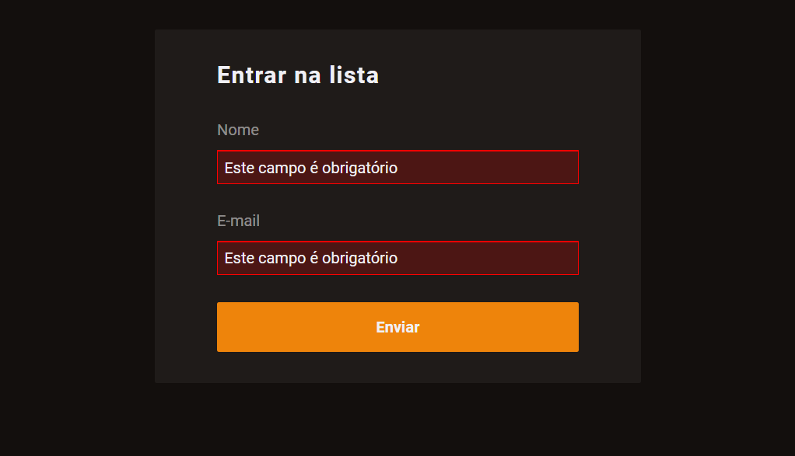

  

## About the component

  Based on the use of "invalid" and "blur" events, applicable to the fields of a form, and on the validation and presentation of customized messages to the user, this component references a form whose fields are validated in a fully customized way.

## README versions

  <a href="https://github.com/trybrito/practicing-form-data-validation/blob/main/README.md">
    Portuguese (pt-br)</a>
  |   
  <a href="https://github.com/trybrito/practicing-form-data-validation/blob/main/README-en.md">
    English (en-us)</a>

